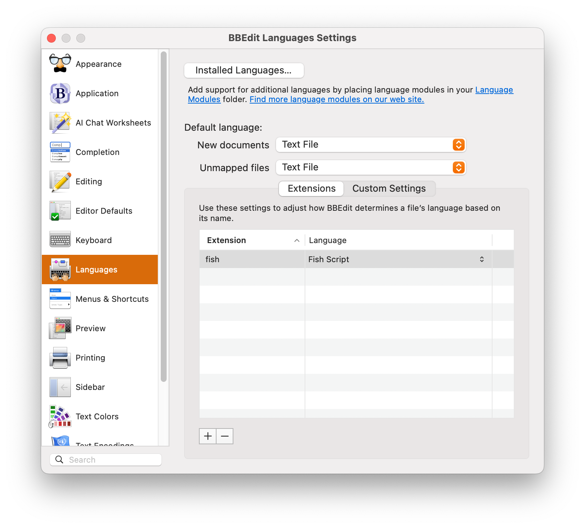
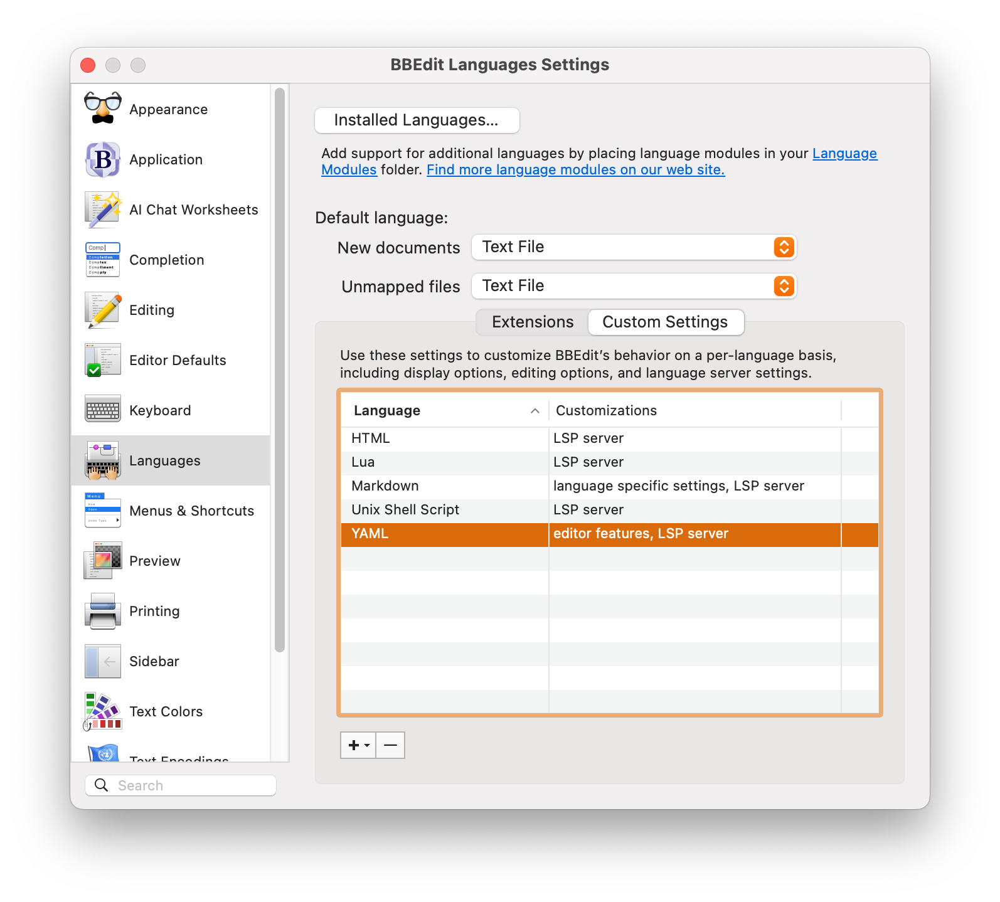
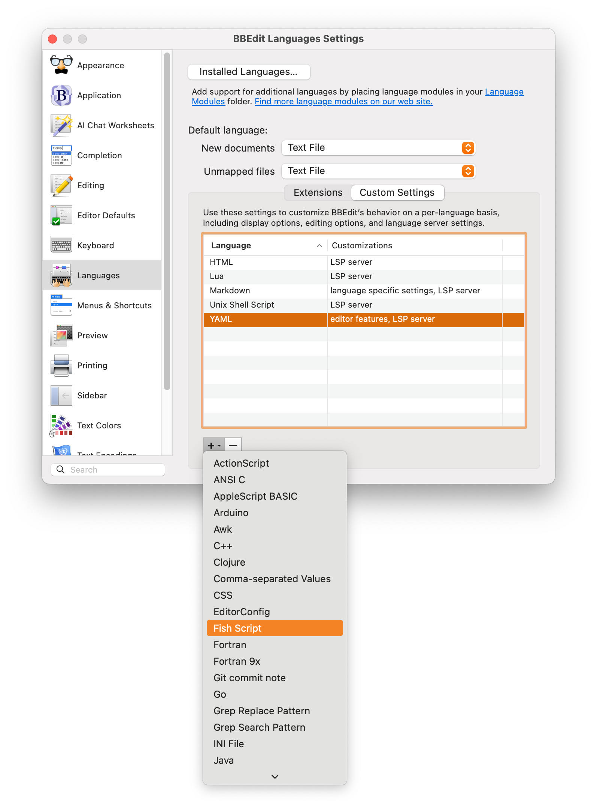
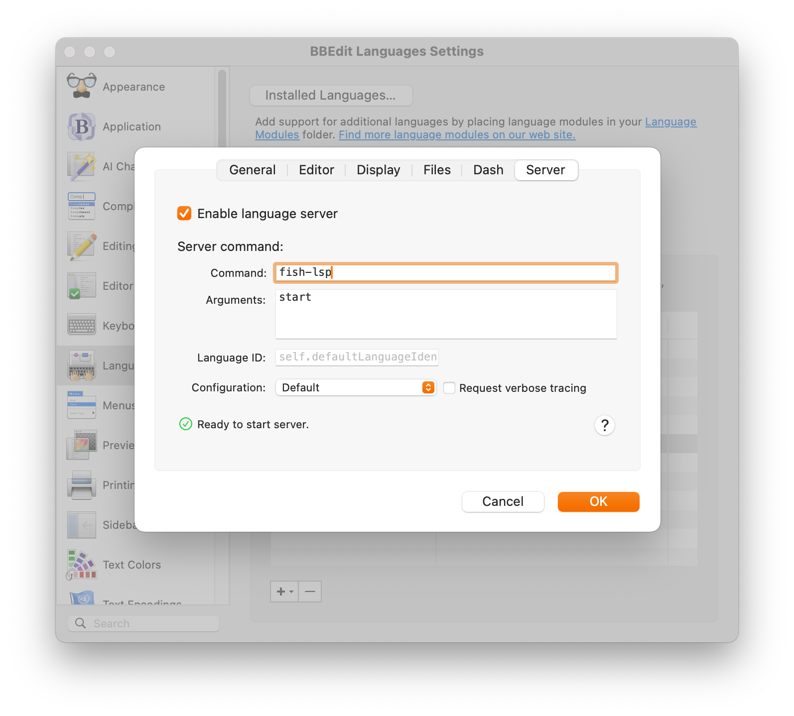

# BBEdit Fish Shell Language and LSP Configuration

Adding language server support to BBEdit requires you to first install a [`clm`
(Codeless Language Model) for the `.fish` file type][clm]. A copy of this file
is included in this repository. You will want to install it into the BBEdit
"Language Modules" folder. You can find this folder either in:

```
/Users/<username>/Library/Application Support/BBEdit/Language Modules/
```

or by using the "BBEdit" menu, selecting "Folders" and choosing "Language
Modules".

Once installed, BBEdit will be able to recognize and color Fish Shell Scripts.
To add the [Fish Language Server][flsp], you will need to follow the
instructions found in the `README` file. Generally, if you have Homebrew
installed, you can issue the following command in the Terminal:

```shell
brew install fish-lsp
```

This should install `node.js` if needed, and then install the module properly,
including the Fish Shell completions module.

Once installed, you can now configure BBEdit to support the LSP:

First, open the BBEdit settings via the "BBEdit" Menu item, or by using
<kbd>Cmd+,</kbd>. Once the window is showing, find and select the
"Languages" section:



If you have not configured a mapping for `.fish` to the "Fish Script" CLM, then
you may do so now. Though it is not strictly required for the functionality of
the LSP.

Procede to the "Custom Settings" tab:



From this screen, choose the `+` button under the custom settings listing, you
should have a menu that lists all the supported languages in BBEdit, find the
"Fish Script" one and select it:



Once selected, a new interface will pop-up showing the configuration options for
the "Fish Shell" language. Choose the "Server" tab from the list of tabs
available and ensure that the "Enable language server" checkbox is checked. In
the "Server command" section, add `fish-lsp` for the "Command" option and
`start` for the "Arguments" option. Everything else should be left as
configured:



If all goes well, a circular green checkmark should appear below the settings
stating "Ready to start server." You can now click "OK", closing that dialog and
then close the BBEdit settings window. From now on, you should be able to open
any `.fish` file and the syntax should get proper highlighting and the
`fish-lsp` should be checking the syntax and other style guides inside of
BBEdit!

[clm]: https://github.com/ideabucket/bbedit-fish-clm
[flsp]: https://github.com/ndonfris/fish-lsp