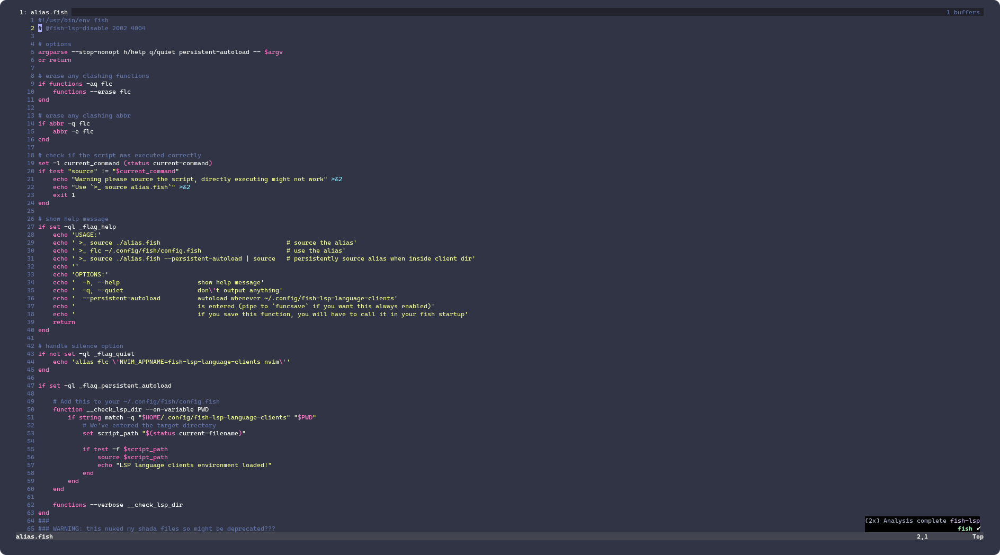

<!-- markdownlint-disable-file -->
# fish-lsp-language-clients

This should allow you to test the language server by creating a standalone [`neovim`](https://neovim.io/) configuration.

This config expects __neovim version__ `0.11.1` or later. Older versions of neovim, do not have the same API as this version, and therefore will not work with configuration provided here.

If you are not currently using a neovim version that is compatible with the requirements listed, you can install a neovim version manager (see [bob-nvim](https://github.com/MordechaiHadad/bob)) and still use this configuration to test the language server.




## About

This config uses [packer.nvim](https://github.com/wbthomason/packer.nvim) with a couple of [plug-ins](./lua/plugins.lua) to help provide QOL features for interacting with the [fish-lsp](https://github.com/ndonfris/fish-lsp). The current configuration is only using a couple of plug-ins, and tries to take advantage of using the native-lsp API. 

It generally tries to achieve language client features by directly implementing them in lua. This barebones approach has proven to be helpful for confirming cross-platform compatibility, as features here are generally expected to be compatible with other language-clients.

> Other text-editors, like VSCode, often have many different ways to interact with a language server. 
>
> In short, different text-editors __might__ send different requests to the language server for the same feature, causing incompatibility (i.e., VSCode's language-client trims whitespace before sending a request to the language-server & neovim's native-lsp does not). 
>
> By using the basic client support, seen here, detecting edge cases is significantly more straightforward.


## Requirements

- [neovim](https://neovim.io/) version `0.11.1` or later
- [fish-lsp](https://fish-lsp.dev/)
- [fish](https://fishshell.com/)

## Installation

1. Clone this repository to your local machine in the directory ~/.config/fish-lsp-language-clients

    ```bash
    git clone https://github.com/ndonfris/fish-lsp-language-clients.git ~/.config/fish-lsp-language-clients
    cd ~/.config/fish-lsp-language-clients
    ```

2. Switch to this branch

    ```bash
    git switch packer
    ```

3. Use this configuration for neovim

    ```bash
    NVIM_APPNAME=fish-lsp-language-clients nvim
    # NVIM_APPNAME=fish-lsp-language-clients nvim ~/.config/fish/config.fish
    ```

4. Optionally, see the [usage](#usage) section for more information on how to use this configuration.


## Usage

This branch comes with most features enabled through relatively normal [keybindings](#Keymaps) and a few custom ones. 

It also comes with an [`alias.fish`](./alias.fish) file that allows for quickly testing the language server. 

If you want to continue using this branch to test the language server, see the __persistent autoloading__ [option on the `alias.fish` script](#custom-usage)

#### Default usage (like other branches)

<!-- NVIM_APPNAME=fish-lsp-language-clients nvim ~/.config/fish/config.fish -->
```fish
alias flc-conf="NVIM_APPNAME=fish-lsp-language-clients nvim ~/.config/fish/config.fish"

# or

alias flc="NVIM_APPNAME=fish-lsp-language-clients nvim"
```

#### Custom Usage

Use the [`alias.fish`](./alias.fish) file, to quickly access the working client configuration for the language server.

```fish
# single session autoloading 
source ./alias.fish -q --persistent-autoload | source

# persistent autoloading across all future sessions
source ./alias.fish -q --persistent-autoload > $__fish_config_dir/conf.d/__check_lsp_dir.fish
echo '__check_lsp_dir' >> $__fish_config_dir/conf.d/__check_lsp_dir.fish
```

## Keymaps

> [!NOTE]
> Which key is included in this config, so you can interactively see a keymapping

<div align="center">

| Keymap | Mode | Description |
|--------|-------------|-------------|
| `C-space` | insert  | Trigger completion |
| `<Tab>` | normal | Trigger/move through completions |
| `C-j` | insert  | move down completion menu |
| `C-k` | insert  | move up completion menu |
| `C-d` | insert  | scroll down completion menu |
| `C-u` | insert  | scroll up completion menu |
| `C-d` | normal  | scroll down hover doc or normal scroll |
| `C-u` | normal  | scroll up hover doc or normal scroll |
| `gs` | normal  | show hover doc |
| `K` | normal  | show hover doc |
| `gd` | normal  | go to definition |
| `gi` | normal  | go to implementation |
| `gr` | normal  | get references |
| `<leader>rn` | normal  | rename symbol |
| `<leader>f` | normal  | format document |
| `<leader>ca` | normal  | code action |
| `gca` | normal  | code action |
| `<C-s>` | insert | show signature help |
| `<leader>e` | normal | show diagnostics |
| `gen` | normal | go to next diagnostic error |
| `gep` | normal | go to next diagnostic error |
| `<leader>qf` | normal | quickfix list |
| `<leader>i` | normal | show tree-sitter tree |
| `<leader><C-t>` | normal | open terminal buffer |
| `<leader><C-b>` | normal | open bottom split terminal buffer |
| `<leader>cc` | normal | toggle comment |
| `g?` | normal | show man page for word under cursor |
| `gfo` | normal | enable folds for buffer |
| `<leader>so` | normal | toggle client symbol outline |
| `<leader>ff` | normal | find files |
| `<C-space>` | normal | find files |
| `<leader>fb` | normal | find buffers |
| `<leader>W` | normal | search workspace symbols |
| `<leader>D` | normal | search document symbols |

</div>

## Customization

While this config was written primarily to avoid having to customize a neovim
configuration, it does ship some customization options.

| Option | Description | Default | 
| ------ | ----------- | ------- | 
| `vim.g.enable_custom_keymaps` | enable all of the keymaps shipped with the config | `true` |
| `vim.g.enable_tmux_keymaps` | enable keymaps for tmux | `true` |
| `vim.g.enable_tmux_notifications` | enable tmux keymaps to display a notification when used | `true` |

